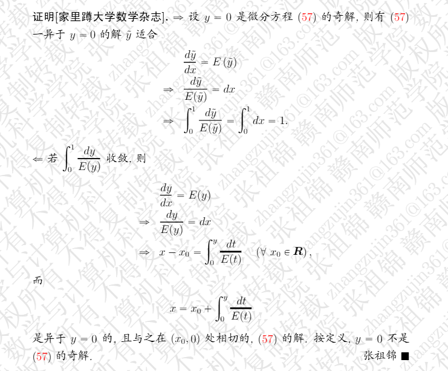

# 微分形式的拉回(pull back)
$\dfrac{2}{3}$

表格:

| 表头 | 表头 |
| ---- | ---- |
| 内容 | 内容 |
| 内容 | 内容 |

$(1+2)/$

$\dfrac{1}{2}$

$\begin{pmatrix} 
    1 & 2 & 3 \\
    2 & 4 & 3 
\end{pmatrix}$ 

$\begin{pmatrix} 
    2 & 5 & 4 \\
    3 & 3 & 5 \\
    6 & 7 & 8 \\ 
\end{pmatrix} $
$\frac{3}{}$
$\sqrt{}$
$\hat{}$
$^{3}$
$^{2}$
$\bm{1}$
$\infty$
$\sum_{k=0}^{\infty} c_k (x-a)^k $
$\lim_{n \to \infty}$
$\frac{\mathrm{d}y}{\mathrm{d}x}$
$\begin{bmatrix}1&1&\cdots&1\\1&1&\cdots&1\\\vdots&\vdots&\ddots&\vdots\\1&1&\cdots&1\end{bmatrix}$

$\begin{bmatrix}
    a_{11} & a_{12} & \cdots & a_{1n} \\
    a_{21} & a_{22} & \cdots & a_{2n} \\
    \vdots & \vdots & \ddots & \vdots \\
    a_{n1} & a_{n2} & \cdots & a_{nn}
\end{bmatrix}$
| 2 | 3 | 4 |
|---|---|---|
| 4 | 4 | 4 |
| 5 | 5 |5  |

$\begin{bmatrix} 4 & 3 & 4 & 5 \\\end{bmatrix}$

$\begin{bmatrix} 3 \\ 4 \\ 5 \\ 6 \\ 7 \\\end{bmatrix}$

$\begin{bmatrix} 3 & 4 & 5 \\ 3 & 4 & 5 \\ 3 & 4 & 6 \\\end{bmatrix}$

$\begin{bmatrix}\frac{\partial f_1}{\partial x_1}&\frac{\partial f_1}{\partial x_2}&\cdots&\frac{\partial f_1}{\partial x_n}\\\frac{\partial f_2}{\partial x_1}&\frac{\partial f_2}{\partial x_2}&\cdots&\frac{\partial f_2}{\partial x_n}\\\vdots&\vdots&\ddots&\vdots\\\frac{\partial f_n}{\partial x_1}&\frac{\partial f_n}{\partial x_2}&\cdots&\frac{\partial f_n}{\partial x_n}\end{bmatrix}$

$f\colon \mathbb{R} \to \mathbb{R}, x \mapsto  y$

$\sim $

$\operatorname{Pr}$

$\overrightarrow{a}$

$y^{2}(g^{2})$
$x_1^{2}(f(x))$

$\dfrac{2}{3}$
$\dfrac{x^{2}}{f^{2}\cdot g^{5}} \cdot h^{5}$

$\dfrac{x+y}{3}$